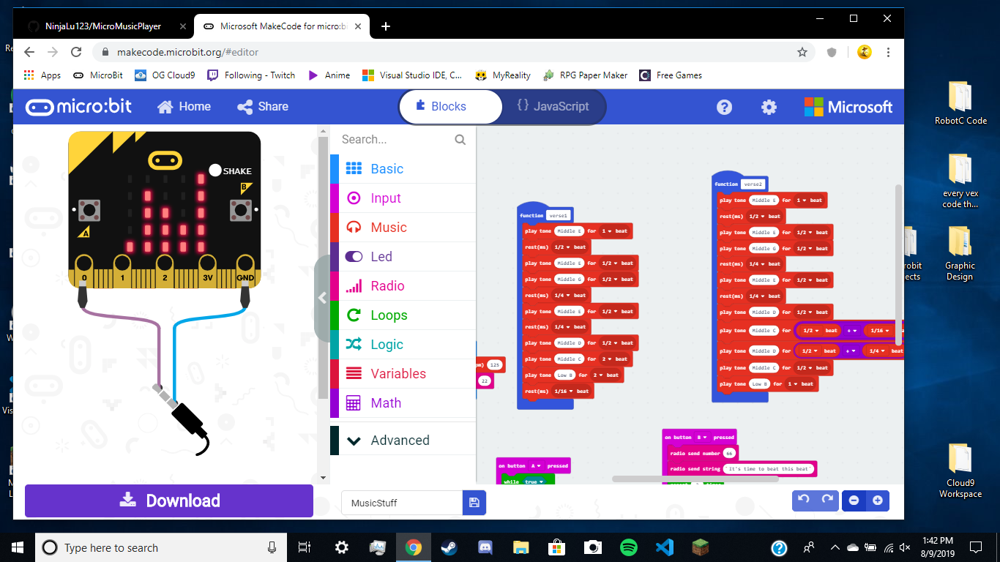

# SoarCS 2019!

<!-- Note, the line below this one is what links to your screenshot, **DO NOT REMOVE** -->

<!--
In this file, you should write a brief description of what your
project is, what you learned, and a simple screenshot of your work.

To add a screenshot, please replace `screenshot.png` with
your own screenshot.
-->

## Double Micro Bit Music Player

In short, I've recreated the melody to Seven Nation Army by The White Stripes. The first micro:bit uses the MusicStuff file which plays the main guitar riff. The second micro:bit in use introduces the background bass after the first verse.
